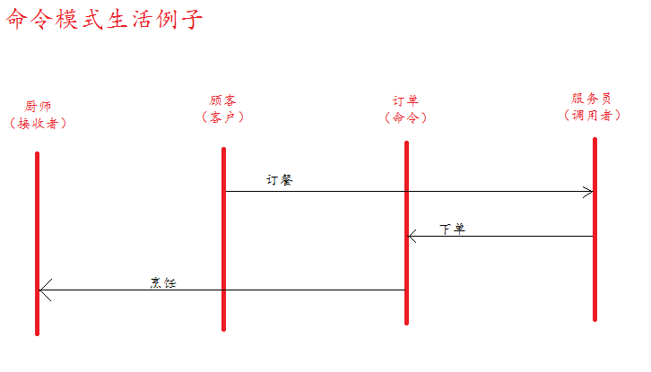

## 命令模式

### 意图
将一个请求封装为一个对象，从而使你可用不同的请求对可进行参数化，
对请求排队或记录请求日志，以及支持可撤销的操作。

### 生活例子

### 组成
- 客户角色：创建一个具体命令对象，并确定其接收者
- 命令角色：声明一个给所有具体命令类的抽象接口。这是一个抽象角色，
通常由一个接口或抽象类实现。
- 具体命令角色：定义一个接收者和行为之间的弱耦合，实现execute方法
，负责调用接收者的相应操作
- 请求者角色：负责调用命令对象执行请求
- 接收者角色：负责具体实施和执行一个请求